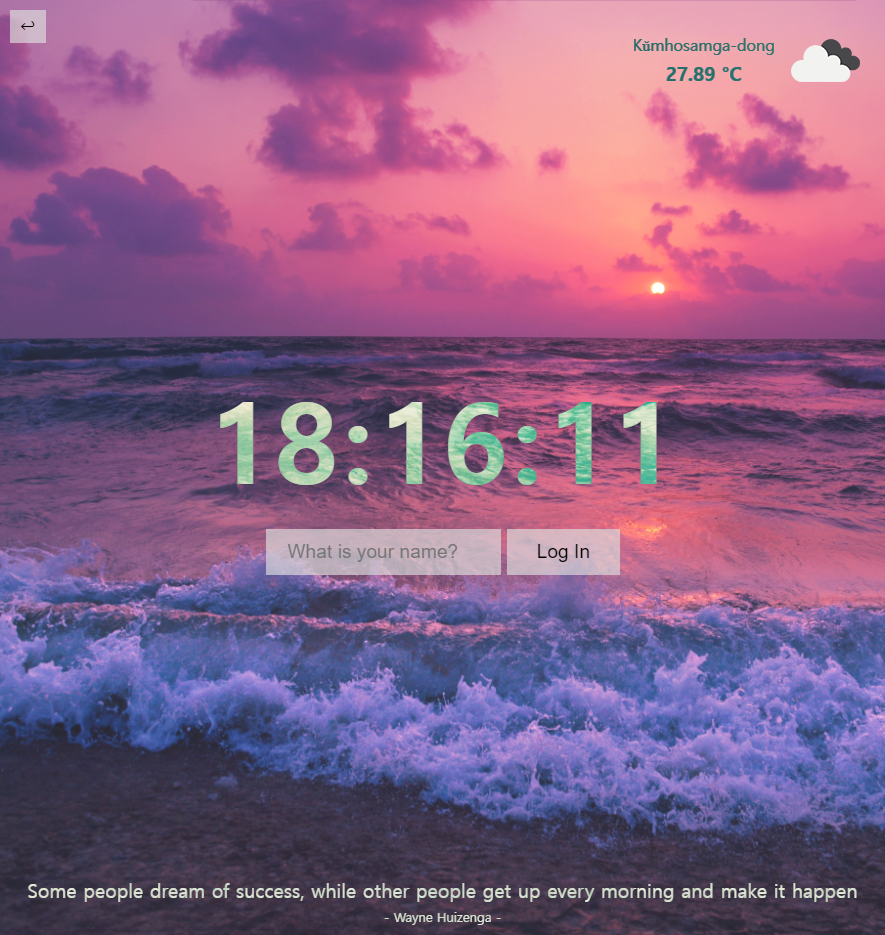
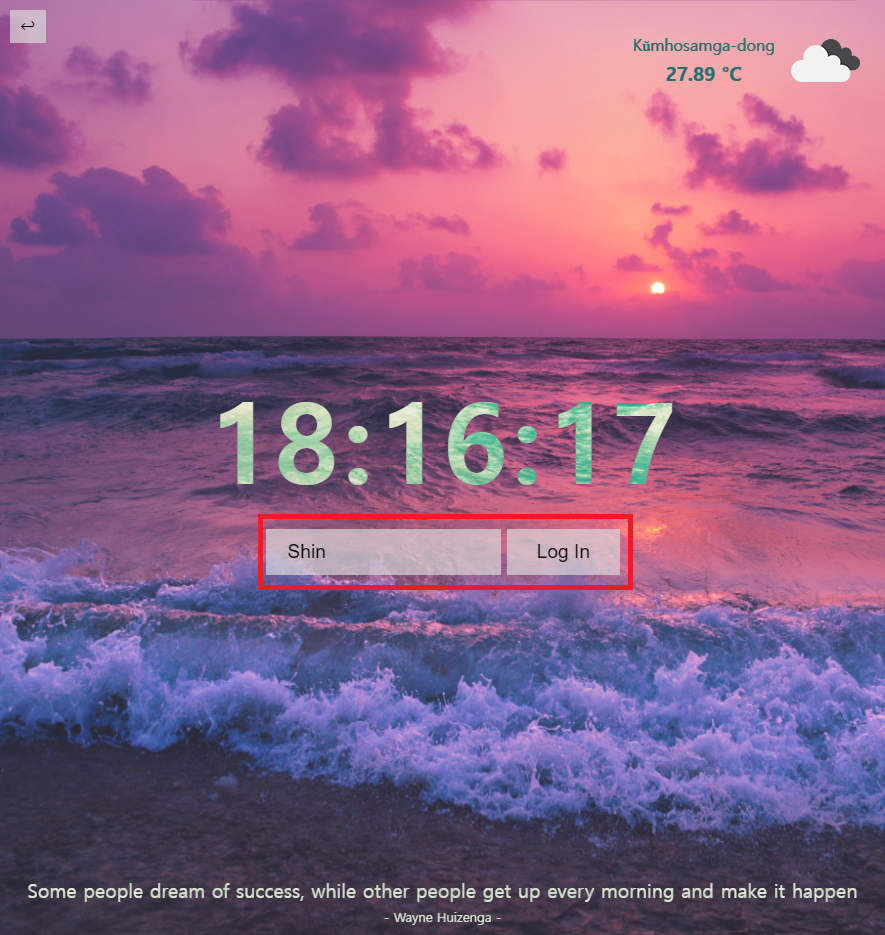
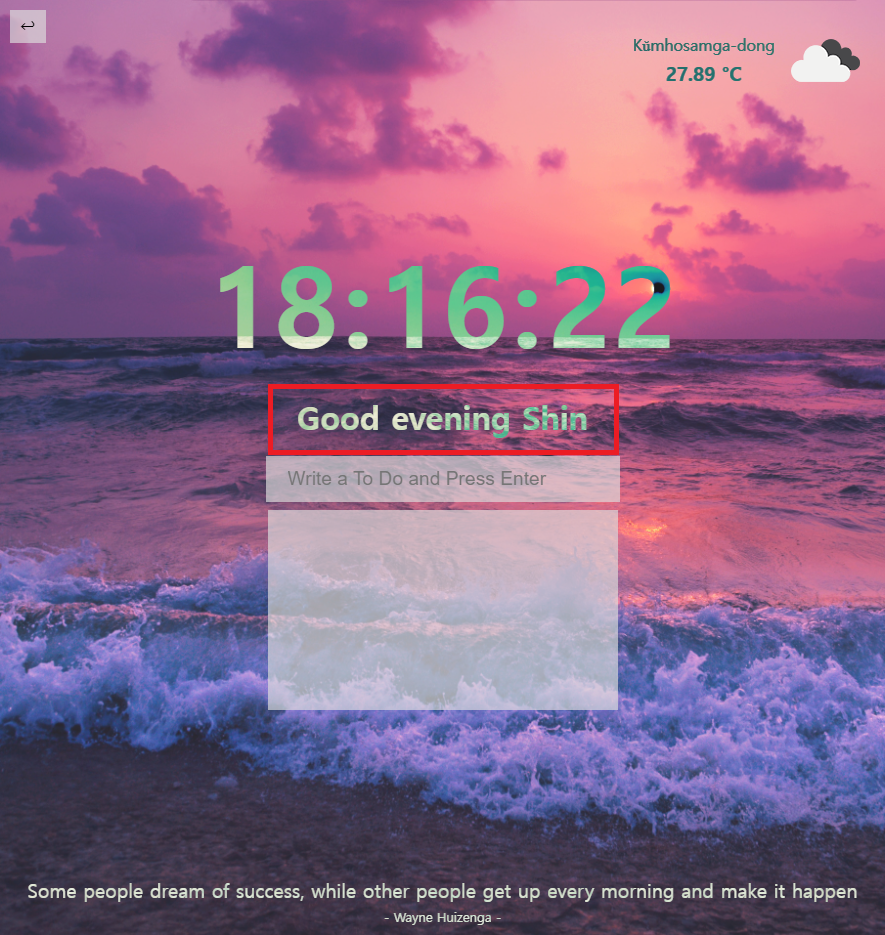
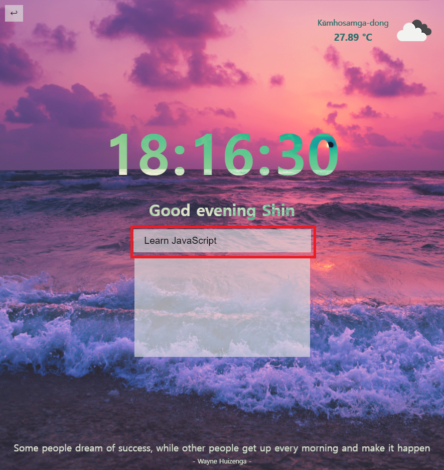
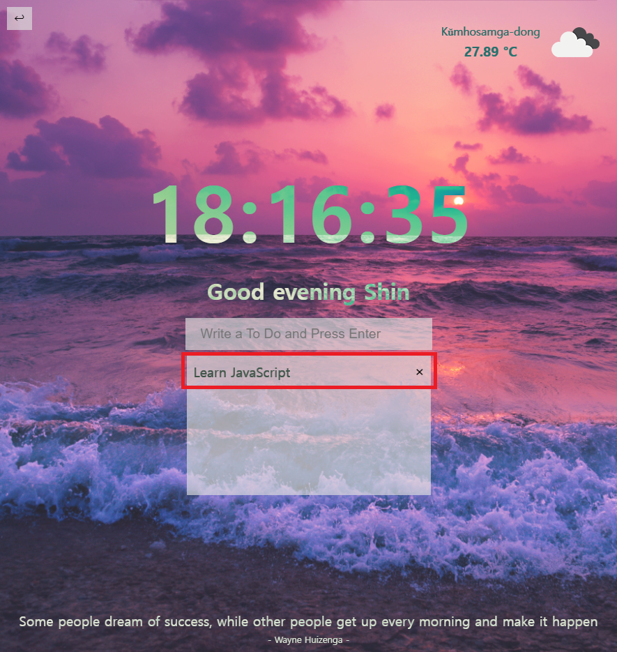
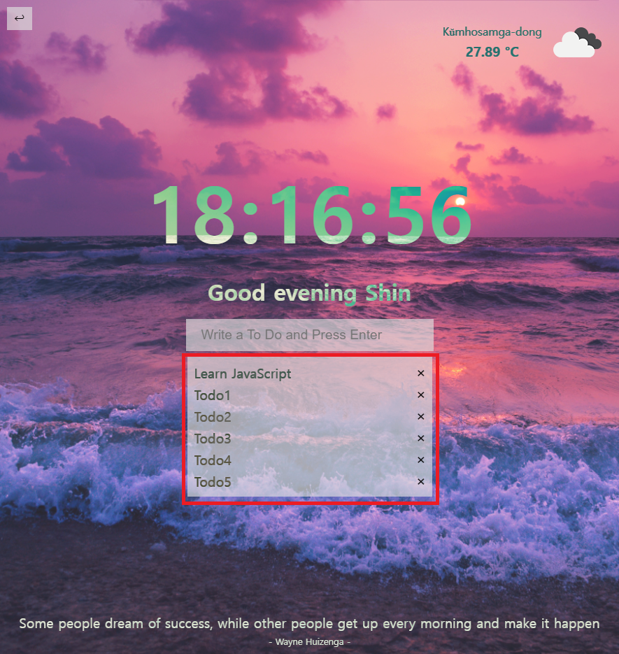
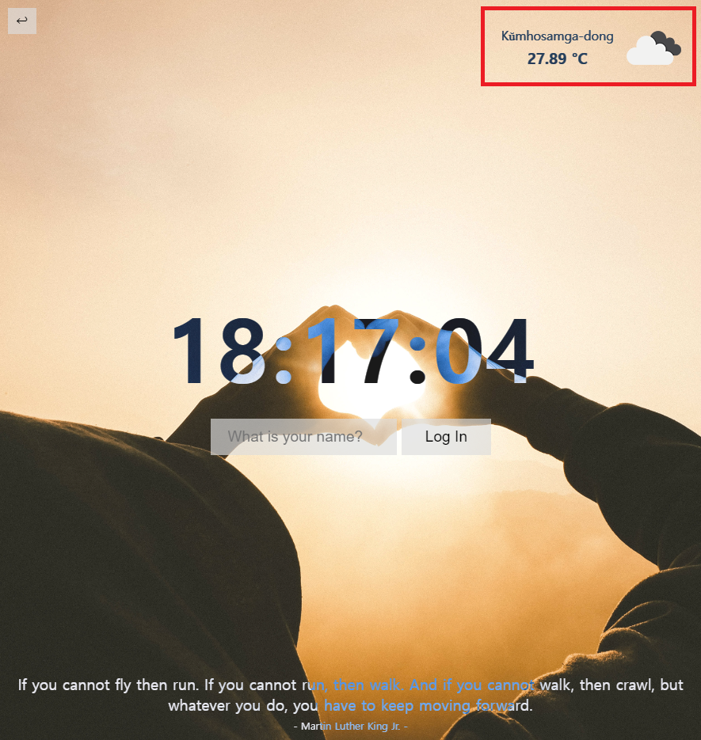
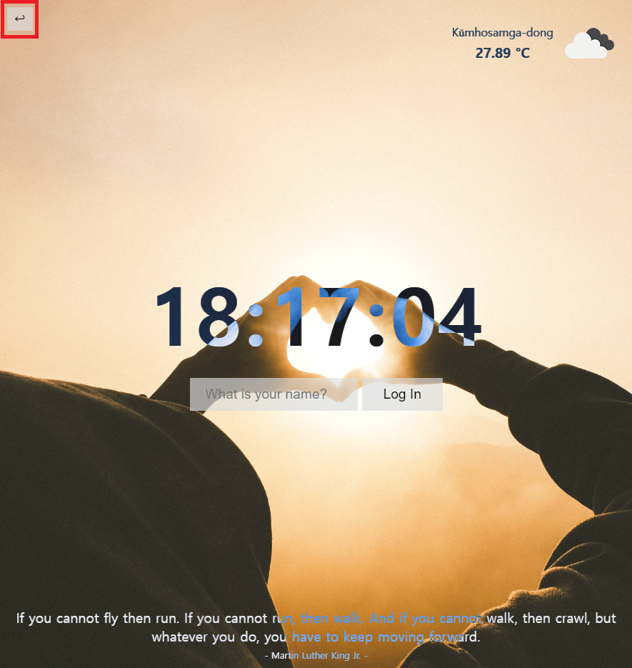

# momentum-clone

- Github Pages를 이용해 배포한 [momentum-clone 보러가기](https://hye0ngyun.github.io/momentum-clone/)
- 구글 크롬 확장프로그램 Momentum 클론
- Momentum 공식 홈페이지 [https://momentumdash.com/](https://momentumdash.com/)

## Project Goal

- 바닐라 자바스크립트를 이용해 구글 크롬 확장 Momentum 기능 클론
- 기능 클론하며 바닐라 자바스크립트 학습
- fetch함수와 api호출 학습

## Table of Contents

- [momentum-clone](#momentum-clone)
  - [Project Goal](#project-goal)
  - [Table of Contents](#table-of-contents)
  - [Using Skills & Stacks](#using-skills--stacks)
  - [Project Description](#project-description)
    - [로그인](#로그인)
    - [투두리스트](#투두리스트)
    - [랜덤 배경화면과 명언](#랜덤-배경화면과-명언)
    - [날씨](#날씨)
    - [리셋버튼](#리셋버튼)

## Using Skills & Stacks

- language: HTML, CSS, JavaScript
  - HTML
    - form태그와 input require 속성 활용
  - CSS
    - display와 position을 이용한 레이아웃 배치
    - 각 태그별 디자인 커스텀
  - JavaScript
    - localStorage를 이용해 브라우저 캐시로 정보 유지
    - navigator.geolocation를 이용해 사용자의 현재 위치 구하기
    - [openweathermap](https://openweathermap.org/) api를 사용해 사용자 현재 위치의 실시간 날씨정보 가져오기
    - fetch함수 이용해 api 호출
    - DOM 생성 및 조작
    - Date를 이용해 현재 시간 구하기
    - Math.random을 이용해 랜덤 배경화면, 명언 구하기
- framework: None
- library: None
- api: [openweathermap](https://openweathermap.org/)

## Project Description

프로젝트 기능 소개

### 로그인

사용자 이름을 입력하여 로그인 할 수 있습니다. localStorage를 활용하여 사용자 이름을 저장합니다.

현재 시간대에 적합한(morning, afternoon, evening) 대사와 함께 사용자 이름을 보여줍니다.

### 투두리스트

투두리스트 추가, 삭제가 가능합니다. 또한 localStorage를 활용하여 투두리스트 정보를 저장할 수 있습니다.

리스트가 일정 높이를 넘어가면 스크롤해 확인할 수 있습니다.

### 랜덤 배경화면과 명언

페이지가 리로드 될때마다 시간대별(오전, 오후, 저녁) 적합한 랜덤 이미지가 배경화면으로 설정되고, 명언 또한 랜덤으로 확인할 수 있습니다.

### 날씨

사용자가 위치정보를 허용하면, 우측 상단에서 현재위치, 온도, 날씨정보를 확인할 수 있습니다.

### 리셋버튼

좌측 상단의 리셋 버튼을 눌러 사용자 이름, 투두리스트를 초기화 시킬 수 있습니다.

